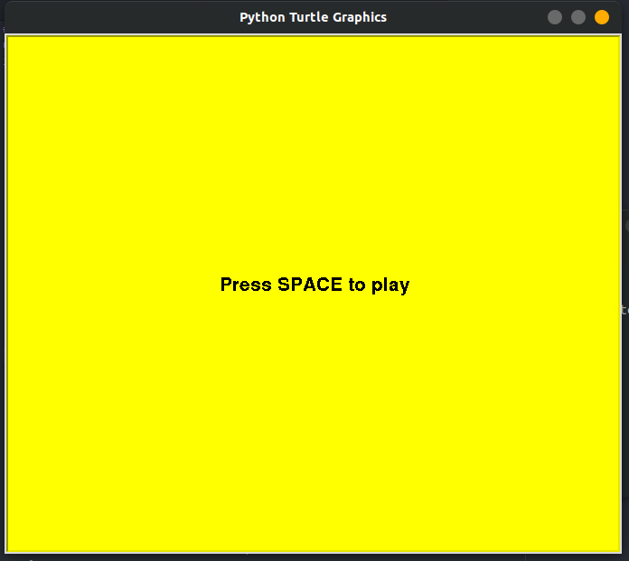
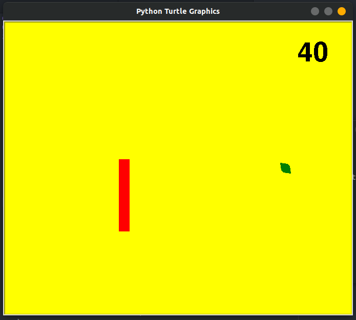
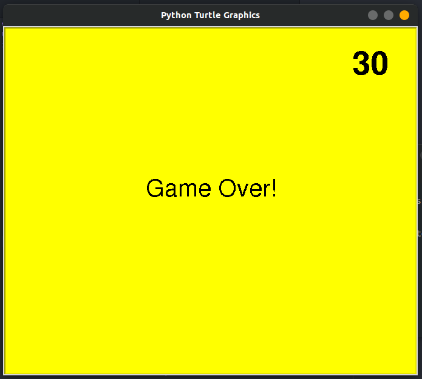

# Caterpillar Game
> Python game implemented using turtle module

Game controlled using keyboard arrows for movement of caterpillar. Objective is to score maximum points by eating the leafs appearing on the screen without hitting the boundary walls.





## Installation
```sh
$ pip install turtle
```

## Usage
```sh
$ python main.py
```
